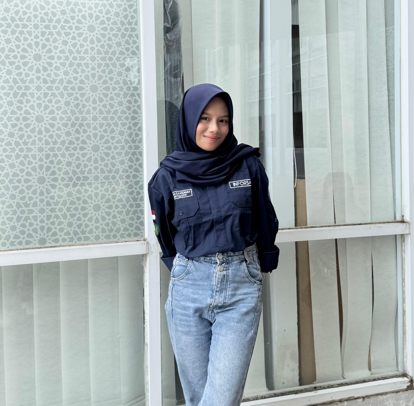

<div align="center">

# 🌸 Mini Project 1 — Portofolio Website  

### 🎨 Personal Portofolio Web Application  
💻 HTML • CSS • Bootstrap • Vue JS  


<br>


</div>

---

# 👩‍💻 Created By

<div align="center">

| 🧾 Informasi | 📌 Detail |
|--------------|-----------|
| **Nama** | Tsabitah Kawiswara |
| **Kelas** | Sistem Informasi C |
| **NIM** | 2409116099 |
| **Mata Kuliah** | Pemrograman Berbasis Web |

</div>

---

# 🌐 Portofolio Website Overview

Website Portfolio ini merupakan website statis yang dibuat menggunakan **HTML, CSS, Bootstrap 5, dan Vue JS**.  
Website ini bertujuan untuk menampilkan identitas diri, pengalaman, keterampilan, dan sertifikat secara visual dengan desain modern, elegan, dan responsif.

Website terdiri dari tiga bagian utama:

- Home Section (Hero Section)
- About Me Section
- Certificates Section

Desain menggunakan konsep **Elegant Feminine Theme** dengan warna dominan **Maroon Gradient**.

Link Website: https://bitasabita.github.io/Mini_Project_1_PBW/

---

# 🛠 Teknologi yang Digunakan

- HTML5
- CSS3
- Bootstrap 5
- Vue JS (CDN)
- Google Fonts

---

# 🎨 Dokumentasi Tampilan Website

---

## 🏠 1. Home Section

<div align="center">


<br><br>
<b>Gambar 1. Tampilan Home Section</b>

</div>

### Penjelasan

Halaman Home merupakan **hero section utama** yang pertama kali dilihat pengguna saat membuka website.  
Bagian ini menampilkan:

- Judul portfolio menggunakan font script elegan (Great Vibes)
- Gallery foto dalam bentuk frame dengan efek bayangan
- Deskripsi singkat tentang diri
- Informasi kontak email
- Layout responsif menggunakan Flexbox

Gallery dibuat secara dinamis menggunakan Vue JS sehingga gambar dapat ditambahkan hanya dari data JavaScript tanpa mengubah HTML.

Efek shadow pada frame memberikan kesan **3D / timbul** agar tampilan lebih modern dan tidak flat.

---

## 👩‍🎓 2. About Me Section

<div align="center">


<br><br>
<b>Gambar 2. Tampilan About Me Section</b>

</div>

### Penjelasan

Halaman About Me berisi informasi lengkap tentang profil diri, pendidikan, pengalaman, dan keterampilan.

Bagian ini dibagi menjadi dua sisi:

### Left Section
- Background gradient maroon
- Foto profil dengan efek frame miring
- Shadow besar untuk kesan floating

### Right Section
- Judul section menggunakan font script elegan
- Deskripsi diri dengan line height nyaman dibaca
- Timeline Education & Experience
- Skills progress bar dengan warna gradient

Timeline dibuat menggunakan CSS pseudo-element sehingga muncul garis vertikal dengan titik indikator.

Progress bar skills dibuat menggunakan CSS width berdasarkan persentase kemampuan.

---

## 📜 3. Certificates Section

<div align="center">


<br><br>
<b>Gambar 3. Tampilan Certificates Section</b>

</div>

### Penjelasan

Halaman Certificates menampilkan daftar sertifikat dalam bentuk **card layout grid** menggunakan Bootstrap.

Fitur visual:

- Background gradient maroon di bagian atas
- Card putih dengan shadow maroon glow
- Hover animation naik ke atas
- Responsive grid (col-md-4)

Data sertifikat ditampilkan menggunakan Vue JS sehingga dapat diubah melalui JavaScript saja.

---


# 🧠 Penjelasan Kode Setiap Section (Detail)

Pada bagian ini dijelaskan secara rinci bagaimana setiap tampilan pada website dibuat menggunakan kode HTML, CSS, Bootstrap, dan Vue JS.

---

# 🔹 1. Struktur Dasar HTML

```html
<!DOCTYPE html>
<html lang="en">
<head>
<meta charset="UTF-8">
<meta name="viewport" content="width=device-width, initial-scale=1.0">
<title>Tsabitah Kawiswara Portfolio</title>
```
### Fungsi Kode

- `<!DOCTYPE html>` → Menentukan bahwa dokumen menggunakan HTML5
- `<html lang="en">` → Bahasa utama website adalah English
- `meta viewport` → Sangat penting untuk **responsive design** di HP
- `<title>` → Judul halaman di tab browser

---

# 🔹 2. Import Bootstrap, Font, dan CSS

```html
<link href="https://cdn.jsdelivr.net/npm/bootstrap@5.3.2/dist/css/bootstrap.min.css" rel="stylesheet">
<link href="https://fonts.googleapis.com/css2?family=Great+Vibes&family=Poppins..." rel="stylesheet">
<link rel="stylesheet" href="style.css">
```

### Fungsi Kode

#### Bootstrap

Bootstrap digunakan untuk:

- Navbar layout
- Container layout
- Grid system (row, col)
- Card certificates
- Responsive utilities


#### Google Fonts

- **Great Vibes** → Font elegan untuk judul
- **Poppins** → Font modern untuk isi teks

#### style.css

File CSS ini berisi seluruh desain custom seperti:

- Warna maroon
- Gradient background
- Timeline
- Skill bar
- Shadow effect
- Hover animation

---

# 🔹 3. Vue JS Root

```html
<div id="app">
```

Kode ini digunakan sebagai **area kerja Vue JS**.

Semua elemen di dalam div ini bisa menggunakan:

- `v-for`
- `{{ }}`
- `:src`
- Data dari JavaScript

Vue dihubungkan dengan:

```javascript
createApp({...}).mount('#app');
```

---

# 🔹 4. Navbar Section

```html
<nav class="navbar navbar-expand-lg navbar-dark fixed-top">
<div class="container">
<a class="navbar-brand" href="#">Tsabitah Kawiswara</a>
```

### Fungsi Bootstrap di Navbar

Class Bootstrap yang digunakan:

| Class | Fungsi |
|-------|--------|
navbar | Komponen navigasi Bootstrap |
navbar-expand-lg | Navbar melebar di layar besar |
navbar-dark | Warna teks terang |
fixed-top | Navbar selalu di atas |
container | Membuat layout rapi tengah |
ms-auto | Menu pindah ke kanan |

Menu responsive mobile dibuat dengan:

```html
<button class="navbar-toggler" data-bs-toggle="collapse" data-bs-target="#menu">
```

<div align="center">


<br><br>
<b>Gambar 4. Navbar Website</b>

</div>

---

# 🔹 5. Home Section (Hero Section)

```html
<section id="home" class="home-section">
<div class="container text-center">
```

### Fungsi

- `section` → Membuat bagian halaman
- `id="home"` → Digunakan untuk navigasi anchor
- `container` → Layout Bootstrap tengah
- `text-center` → Teks rata tengah

Judul menggunakan font elegan:

```html
<h1 class="title">Tsabitah Kawiswara</h1>
```

CSS:

```css
.title{
font-family:'Great Vibes';
font-size:85px;
}
```


---

# 🔹 6. Gallery Vue Loop

```html
<div class="frame" v-for="img in gallery" :key="img">

</div>
```

### Fungsi

Vue akan membaca data:

```javascript
gallery: [
"images/bunga.jpg",
"images/bita.png"
]
```

Kemudian otomatis membuat gambar.

Keuntungan:

- Tidak perlu ulang HTML
- Mudah tambah foto
- Lebih modern

<div align="center">


<br><br>
<b>Gambar 5. Gallery pada Home Section</b>

</div>


---

# 🔹 7. About Section Layout

```html
<section id="about" class="about-wrapper">
<div class="about-left">
<div class="about-right">
```

CSS:

```css
.about-wrapper{
display:flex;
}
```

Artinya halaman dibagi menjadi **2 kolom horizontal**:

| Kiri | Kanan |
|------|-------|
Foto profil | Deskripsi |

---

# 🔹 8. Foto Profil Frame Effect

```html
<div class="photo-box">

</div>
```

CSS:

```css
.photo-box{
background:white;
padding:18px;
transform:rotate(-2deg);
box-shadow:0 25px 50px rgba(0,0,0,0.35);
}
```

Efek yang dihasilkan:

- Frame putih
- Miring sedikit
- Shadow besar
- Tampak seperti foto polaroid

<div align="center">


<br><br>
<b>Gambar 6. Frame Foto Profil</b>

</div>


---

# 🔹 9. Timeline Education & Experience

```html
<div class="timeline">
<div class="timeline-item">
```

CSS garis timeline:

```css
.timeline::before{
width:2px;
background:#7a1c1c;
}
```

Titik indikator:

```css
.timeline-item::before{
width:10px;
border-radius:50%;
}
```

Hasil:

- Garis vertikal
- Titik pengalaman
- Tampilan profesional seperti CV modern

<div align="center">


<br><br>
<b>Gambar 7. Timeline Education & Experience</b>

</div>


---

# 🔹 10. Skills Progress Bar

HTML:

```html
<div class="skill-fill" style="width:85%"></div>
```

CSS:

```css
.skill-fill{
background:linear-gradient(90deg,#7a1c1c,#d96a6a);
transition:width 1.2s ease;
}
```

Fungsi:

- Width menentukan persentase skill
- Gradient membuat warna menarik
- Transition membuat animasi smooth

<div align="center">


<br><br>
<b>Gambar 8. Skills Progress Bar</b>

</div>

---

# 🔹 11. Certificates Section Bootstrap Grid

```html
<div class="col-md-4 mb-4" v-for="cert in certificates">
<div class="card cert-card">
```

Bootstrap digunakan untuk:

| Class | Fungsi |
|-------|--------|
row | Baris grid |
col-md-4 | 3 kolom desktop |
mb-4 | Margin bawah |
card | Komponen kartu |

Vue digunakan untuk menampilkan data sertifikat:

```javascript
certificates:[
{title:"...",image:"..."}
]
```

<div align="center">


<br><br>
<b>Gambar 9. Certificate Card Layout</b>

</div>


---

# 🔹 12. Card Hover Animation

CSS:

```css
.cert-card:hover{
transform:translateY(-10px) scale(1.02);
}
```

Efek:

- Card naik saat hover
- Tampilan interaktif modern

---

# 🔹 13. Footer Section

```html
<footer class="footer">
© 2026 Tsabitah Kawiswara Portfolio
</footer>
```

CSS:

```css
.footer{
background:#6b0f1a;
color:white;
text-align:center;
}
```

Footer berfungsi sebagai penutup halaman dengan identitas website.

<div align="center">


<br><br>
<b>Gambar 10. Footer Website</b>

</div>


---

# 🔹 14. Vue JS Script

```html
<script src="https://unpkg.com/vue@3/dist/vue.global.js"></script>
```

Menghubungkan Vue ke website tanpa install.

Script utama:

```javascript
const { createApp } = Vue;

createApp({
data() {
return {
gallery: [...],
certificates: [...]
}
}
}).mount('#app');
```

Fungsi:

- Menyimpan data website
- Menampilkan data ke HTML
- Membuat website lebih interaktif


---

# ⭐ Kesimpulan Teknis

Website ini dibuat menggunakan kombinasi:

- HTML → Struktur
- CSS → Desain visual
- Bootstrap → Layout & responsive
- Vue JS → Data dinamis

Setiap tampilan yang terlihat di layar merupakan hasil langsung dari kode yang telah dijelaskan di atas.


# ⭐ Fitur Website

- ✅ Navbar Navigation
- ✅ Hero Section Modern
- ✅ Responsive Layout
- ✅ Timeline Education & Experience
- ✅ Skills Progress Bar Gradient
- ✅ Certificate Card Hover Animation
- ✅ Vue JS Dynamic Data
- ✅ Elegant Feminine Design

---

# 🗂 Struktur Folder Project

Sesuai dengan project:

```
project-folder/
│── index.html
│── style.css
│
└── images/
    ├── bita.png
    ├── bitapdh.png
    ├── bunga.jpg
    ├── maron.jpg
    ├── pita.jpg
    ├── sertifikat_inforsa.png
    ├── sertifikat_insevent.png
    └── sertifikat_ukbi.png
```

---


<div align="center">

✨ Terima kasih telah melihat dokumentasi project ini ✨  
  

</div>
